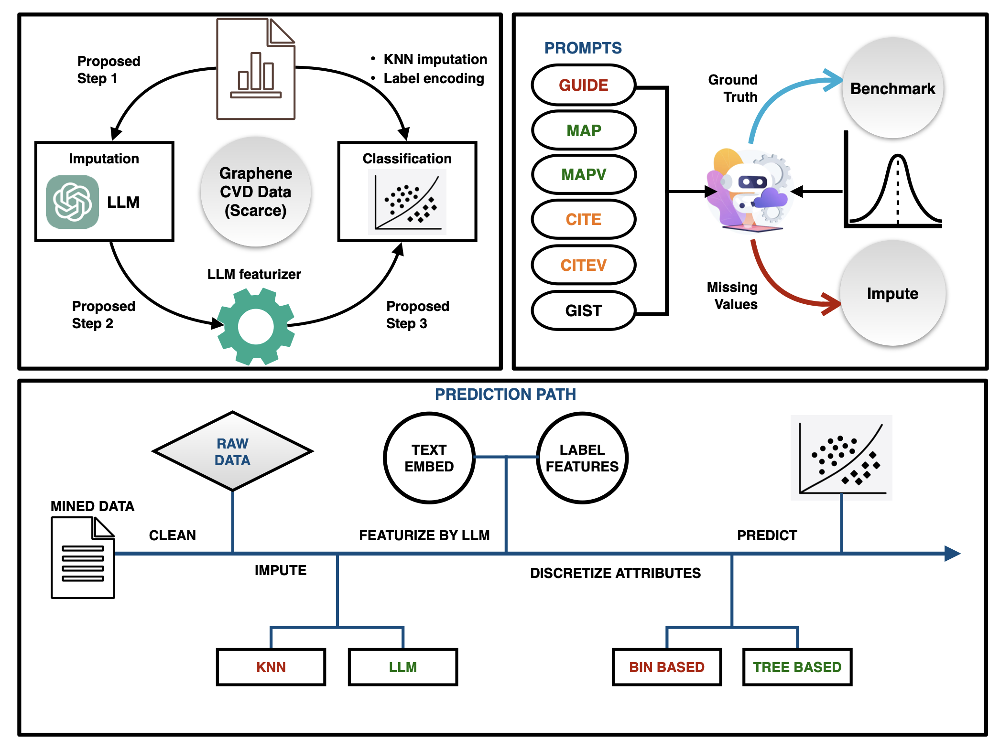

# LLM Strategies for the Scarce LLM Dataset
This code has been developed with the support of the NSF DMREF Collaborative Project – DMR-2119308.

**Note:** To learn about the features of this code, check out the supplementary information file @ [https://arxiv.org/abs/2503.04870](https://arxiv.org/abs/2503.04870)

The implementation is carried out in 4 steps:
1. **Imputation**
2. **Featurization**
3. **Discretization**
4. **Training and Prediction**

**Note:** OpenAI API subscription is required to run the Jupyter notebooks with your API Key.

## Python Scripts Overview

1. **imputation.py**: Imputes missing values using:
    - ChatGPT-4o-mini
    - KNN

2. **featurization.py**: Featurizes "Substrate" using:
    - Label Encoding
    - text-embedding-3-small
    - LLM proposed substrate descriptors
    - Label encoded graphene layers

3. **discretization.py**: Discretizes data using:
    - Equal-width binning
    - Equal-frequency binning
    - K-means binning
    - Decision tree binning

4. **ml.py**: Trains ML models with the datasets produced.

5. **utils.py**: Contains essential functions for each notebook.

## Notebooks: 

**plots.ipynb**: Generates plots to reproduce the results of the manuscript.
**imputation.ipynb**, **featurization_discretization.ipynb**, **ml.ipynb**, **PrepareDataset_FTGPT.ipynb**

**To fine tune the ChatGPT-4o-mini model, the train and validation datasets are provided in the Data/Fine Tuning folder**